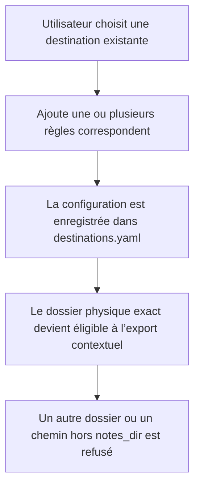
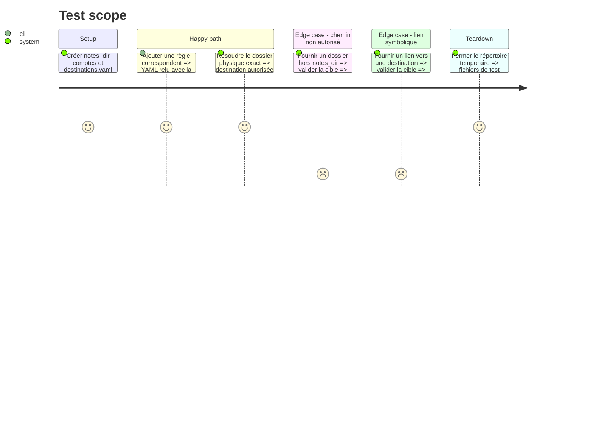

# Instruction: Dossiers autorisés et règles de correspondants

## Architecture projection

> Tree of the final files. ✅ create · ✏️ modify · ❌ delete

```txt
.
├── ✏️ src/destinations.rs
├── ✏️ src/route.rs
├── ✏️ src/dest_cmd.rs
├── ✏️ src/tray.rs
├── ✏️ assets/destinations_window.html
├── ✏️ tests/rust_tests.rs
└── ✏️ README.md
```

## User Journey



## Test Scope



## Tasks to do

### `1)` Représenter un correspondant

> Ajouter une règle déterministe qui couvre une adresse présente comme expéditeur ou destinataire.

1. Ajouter `Correspondent(String)` aux types YAML et runtime.
2. Faire correspondre la règle avec les champs From, To, Cc et Bcc lorsqu’il est présent, sans changer la sémantique de `From`.
3. Préserver le format et la lecture des configurations existantes.

### `2)` Exposer la règle dans les éditeurs

> Permettre la création et la suppression de correspondants par CLI et par la fenêtre des destinations.

1. Ajouter l’option CLI et le type de règle GUI.
2. Valider qu’un correspondant est une adresse syntaxiquement exploitable avant sauvegarde et afficher l’erreur dans l’éditeur concerné.
3. Réutiliser les chemins de sauvegarde et les contrôles anti-symlink existants.
4. Normaliser les adresses pour la comparaison sans modifier leur valeur affichée.

### `3)` Résoudre un dossier contextuel

> Transformer un chemin physique en destination exacte et autorisée.

1. Canonicaliser `notes_dir` et la cible.
2. Refuser les liens symboliques, les chemins inexistants et les sorties de racine.
3. Construire puis canonicaliser le chemin physique de chaque destination existante et comparer son identité à la cible, plutôt que comparer des chaînes sensibles à la casse ou à la normalisation Unicode.
4. Exiger que l’entrée physique correspondante porte au moins une règle de recherche exploitable.
5. Traduire `correspondent`, `from` et `domain` avec la même logique OR que le routage; traiter plusieurs règles `account` comme une liste OR de boîtes autorisées.
6. Garder `subject` réservé au routage global: une destination sans règle d’adresse ne rend pas l’action contextuelle disponible.
7. Refuser l’action si aucune boîte configurée ne satisfait les éventuelles règles `account`.

### `4)` Documenter la configuration

> Montrer comment associer les correspondants aux dossiers existants.

1. Ajouter un exemple YAML.
2. Distinguer `from` de `correspondent`.
3. Expliquer que la destination exacte sert de cible directe, sans suffixe année/mois.

## Test acceptance criteria

| Task | Acceptance criteria |
| ---- | ------------------- |
| 1 | Une règle `correspondent` relue depuis YAML correspond à la même adresse dans From, To, Cc ou Bcc disponible, tandis qu’une règle `from` reste limitée à From. |
| 2 | Les éditeurs CLI et GUI enregistrent et retirent une adresse valide sans altérer les autres entrées, et refusent une adresse inexploitable. |
| 3 | Seul le même dossier physique réel sous `notes_dir` est accepté, y compris avec les règles de casse et Unicode propres au volume; une règle `account` filtre les boîtes proposées. |
| 4 | La documentation permet de configurer un dossier contextuel sans connaître le code. |
