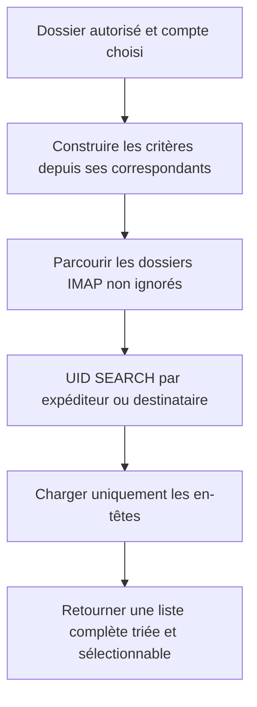
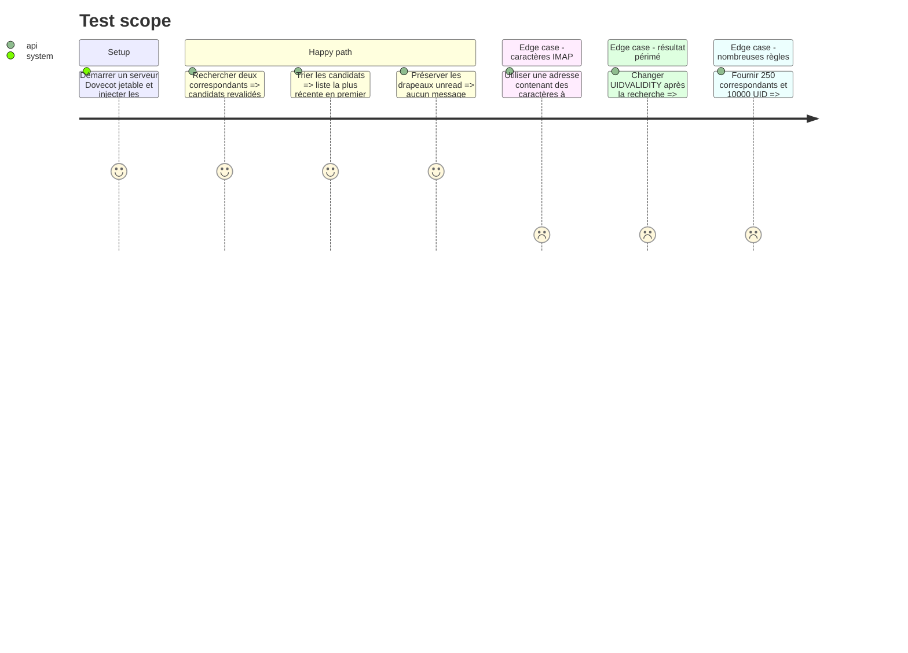

# Instruction: Recherche IMAP ciblée et résultats stables

## Architecture projection

> Tree of the final files. ✅ create · ✏️ modify · ❌ delete

```txt
.
├── ✅ src/contextual_export.rs
├── ✅ tests/imap_integration.rs
├── ✅ tests/fixtures/imap/compose.yaml
├── ✅ tests/fixtures/imap/seed/
├── ✏️ src/lib.rs
├── ✏️ src/email_export.rs
└── ✏️ tests/rust_tests.rs
```

## User Journey



## Test Scope



## Tasks to do

### `1)` Définir le contrat de recherche

> Isoler les entrées et résultats de l’export contextuel du pipeline global.

1. Créer les types cible, requête, candidat et identifiant de message.
2. Inclure compte, dossier brut et affiché, UIDVALIDITY, UID, Message-ID, empreinte normalisée des en-têtes, identifiant fournisseur optionnel, date, From, To, Cc, Bcc disponible et sujet.
3. Représenter un candidat logique avec une ou plusieurs localisations IMAP afin de conserver les occurrences sous plusieurs labels.
4. Garder ces types indépendants de la WebView et des intégrations OS.

### `2)` Construire les critères IMAP

> Produire une recherche serveur sûre pour plusieurs correspondants.

1. Échapper les chaînes IMAP sans concaténation non contrôlée.
2. Imbriquer les opérateurs `OR` pour toutes les règles d’adresse exploitables de la destination.
3. Reproduire leur sémantique: `correspondent` sur From/To/Cc/Bcc disponible, `from` sur From et `domain` sur From.
4. Exclure les messages déjà marqués Deleted et les dossiers ignorés.
5. Considérer la recherche serveur comme un préfiltre par sous-chaîne, jamais comme la décision finale de correspondance.
6. Dédupliquer les critères puis découper les recherches en lots bornés de 50 critères; fusionner les ensembles d’UID avant chargement des en-têtes.

### `3)` Rechercher par UID et précharger les en-têtes

> Lister les correspondances sans télécharger les corps ni marquer les messages comme lus.

1. Réutiliser la connexion, le listing et le filtrage des dossiers d’`ImapExporter`.
2. Utiliser `uid_search` puis `uid_fetch` avec `BODY.PEEK` limité aux en-têtes utiles.
3. Capturer UIDVALIDITY à chaque sélection de dossier et `X-GM-MSGID` lorsque `X-GM-EXT-1` est annoncé.
4. Implémenter la lecture de `X-GM-MSGID` via la commande bas niveau de `Session` et le parseur `imap-proto` déjà dépendant, sans supposer un champ Gmail dans `Fetch`.
5. Dédupliquer d’abord par compte et identifiant fournisseur, sinon par Message-ID normalisé plus empreinte des en-têtes; en cas d’empreintes différentes ou d’identité absente, conserver des candidats distincts.
6. Revalider chaque en-tête avec les fonctions exactes du routeur, notamment frontière de domaine et adresse parsée, puis éliminer les faux positifs du serveur.
7. Charger les en-têtes par lots d’au plus 500 UID afin de borner la taille des commandes et des réponses.
8. Fusionner les localisations d’un candidat logique et trier les résultats de tous les dossiers.

### `4)` Rendre la logique testable sans serveur

> Tester les transformations pures et délimiter la validation IMAP manuelle.

1. Extraire le constructeur de requête et le parseur d’en-têtes.
2. Ajouter des fixtures RFC 2822 et des cas multi-dossiers.
3. Fournir une fixture Dovecot conteneurisée, épinglée par digest, qui crée un compte temporaire et injecte les messages du test avant chaque exécution.
4. Ajouter des tests ignorés activés explicitement par variable d’environnement pour UID SEARCH, UIDVALIDITY, faux positifs de domaine et conservation du drapeau Seen.
5. Décrire une validation Gmail sur un compte dédié, alimenté par des messages générés avec un préfixe unique et nettoyé après le test.
6. Stocker les identifiants du compte Gmail de test dans les secrets du dépôt et interdire explicitement toute adresse personnelle pour cette recette destructive.

## Test acceptance criteria

| Task | Acceptance criteria |
| ---- | ------------------- |
| 1 | Un candidat transporte une clé source non ambiguë et toutes ses localisations pour être revalidé avant conversion sans utiliser de numéro de séquence. |
| 2 | Plusieurs règles produisent un préfiltre OR sûr; 250 correspondants sont traités par lots sans différence de résultat, puis la validation locale écarte les correspondances partielles. |
| 3 | La recherche ne télécharge aucun corps, ne marque rien Seen, distingue deux messages réutilisant un Message-ID et fusionne un message Gmail présent sous plusieurs labels. |
| 4 | Les transformations pures passent sans réseau et les sémantiques UID sont validées sur Dovecot jetable et sur le compte Gmail de test. |
