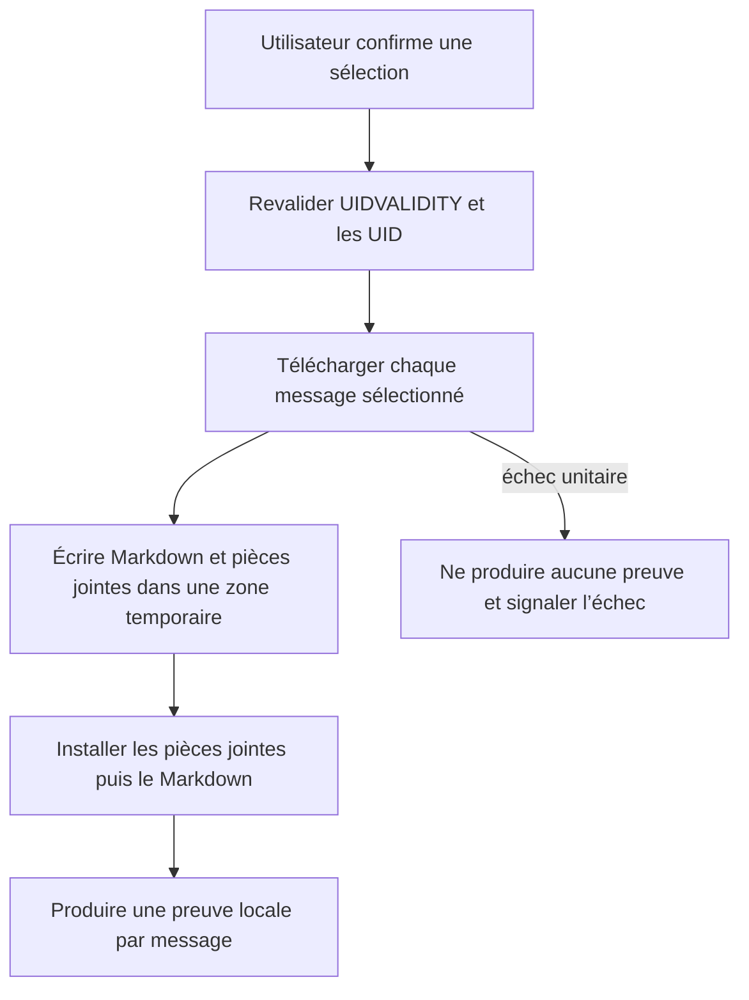
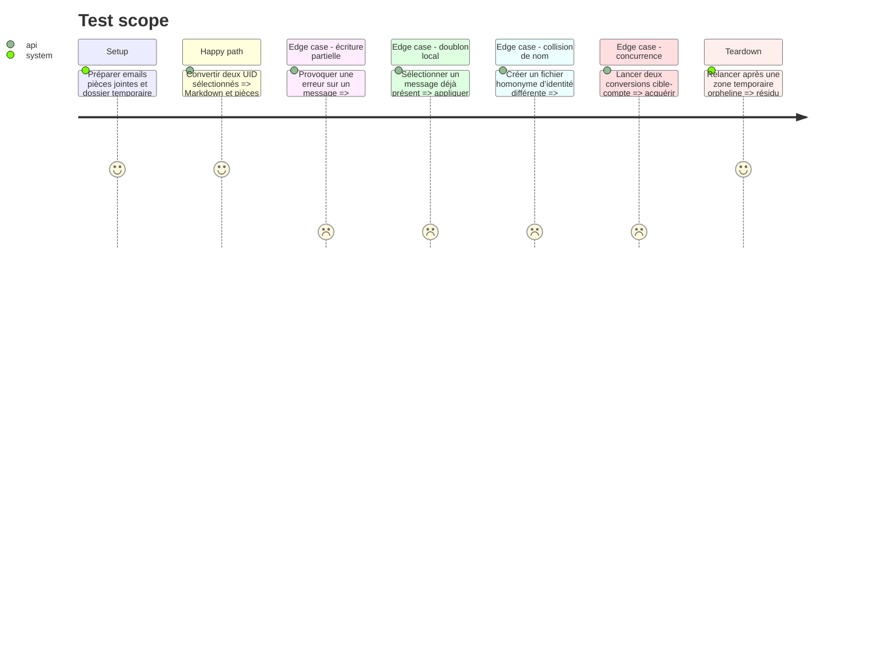

# Instruction: Conversion sélectionnée et preuve locale

## Architecture projection

> Tree of the final files. ✅ create · ✏️ modify · ❌ delete

```txt
.
├── ✏️ Cargo.toml
├── ✏️ src/contextual_export.rs
├── ✏️ src/email_export.rs
├── ✏️ src/route.rs
└── ✏️ tests/rust_tests.rs
```

## User Journey



## Test Scope



## Tasks to do

### `1)` Séparer conversion et routage global

> Réutiliser le convertisseur sans imposer la zone tampon ni le suffixe année/mois.

1. Extraire la production Markdown et pièces jointes dans une fonction recevant un répertoire de sortie.
2. Garder le pipeline global compatible avec cette fonction.
3. Écrire l’export contextuel directement dans le dossier exact choisi.
4. Ajouter au frontmatter une clé source composée du compte, Message-ID, empreinte d’en-têtes, dossier, UIDVALIDITY, UID et identifiant fournisseur disponibles.
5. Détecter la présence locale par compte et identifiant fournisseur, sinon par localisation UID exacte, sinon par Message-ID plus empreinte; ne jamais se fier au seul nom de fichier.
6. En cas de collision entre identités différentes, ajouter un suffixe stable et ne jamais écraser.
7. Traiter un ancien Markdown dépourvu d’identité source comme non prouvé: ne pas autoriser sa suppression serveur et reconvertir sous un nom distinct si l’utilisateur le sélectionne.

### `2)` Convertir une sélection de candidats

> Télécharger uniquement les messages cochés et revalider leur identité.

1. Regrouper les candidats par dossier.
2. Revalider l’identité physique, l’appartenance à `notes_dir`, l’absence de symlink et les capacités locales de la cible immédiatement avant toute création temporaire.
3. Vérifier UIDVALIDITY avant `uid_fetch` avec `BODY.PEEK[]`.
4. Produire un résultat par message avec écrit, ignoré ou erreur.
5. Ne considérer comme réussi qu’un Markdown et toutes ses pièces jointes installés dans la cible.
6. Si la connexion a été recréée ou UIDVALIDITY a changé, invalider la liste entière et exiger une nouvelle recherche.

### `3)` Garantir une preuve locale complète

> Empêcher toute perte lors d’une conversion ou d’un déplacement partiel.

1. Écrire chaque message dans une zone temporaire située sur le même volume avec un préfixe réservé à l’application.
2. Renommer les pièces jointes finalisées en premier et le Markdown en dernier; la présence du Markdown final sert de marqueur de commit local.
3. Déplacer les fichiers avec les protections de chemin et de symlink existantes.
4. Nettoyer la zone temporaire sur succès, erreur et annulation contrôlée.
5. Au lancement suivant, supprimer uniquement les résidus portant le préfixe réservé et plus anciens que le verrou actif; ne jamais assimiler un fichier utilisateur à un résidu.

### `4)` Sérialiser les opérations concurrentes

> Empêcher deux processus d’agir simultanément sur la même destination et le même compte.

1. Utiliser un verrou de fichier exclusif fourni par une crate portable sur une clé cible-compte.
2. Laisser l’OS libérer automatiquement le verrou après crash et conserver dans le fichier PID et horodatage pour le diagnostic.
3. Refuser une acquisition concurrente et ne supprimer le fichier de diagnostic qu’après libération du verrou détenu par ce processus.

## Test acceptance criteria

| Task | Acceptance criteria |
| ---- | ------------------- |
| 1 | Le même convertisseur sert l’export global et l’export direct; les nouveaux champs d’identité sont ajoutés sans casser la lecture des Markdown existants ni écraser un homonyme. |
| 2 | Seuls les UID sélectionnés et encore valides sont traités, et une cible supprimée, remplacée ou devenue symlink est refusée avant écriture. |
| 3 | Le Markdown final n’apparaît qu’après toutes ses pièces jointes; un crash peut laisser uniquement des résidus préfixés que le lancement suivant nettoie de façon bornée. |
| 4 | Une seconde conversion sur la même cible et le même compte est refusée avant toute écriture. |
