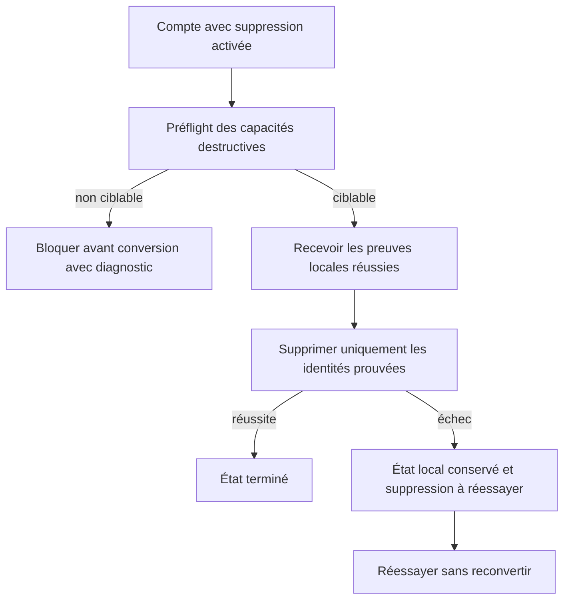
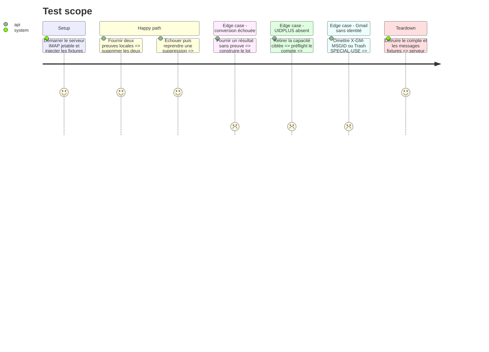

# Instruction: Suppression serveur ciblée et reprise

## Architecture projection

> Tree of the final files. ✅ create · ✏️ modify · ❌ delete

```txt
.
├── ✏️ src/contextual_export.rs
├── ✏️ src/email_export.rs
├── ✏️ src/network.rs
├── ✏️ tests/imap_integration.rs
└── ✏️ tests/rust_tests.rs
```

## User Journey



## Test Scope



## Tasks to do

### `1)` Préflight la suppression configurée

> Savoir avant conversion si le serveur permet une suppression exacte.

1. Interroger les capacités via la commande IMAP bas niveau déjà utilisée pour les extensions Gmail.
2. Pour un serveur générique, exiger le mécanisme permettant `UID EXPUNGE` ciblé.
3. Pour Gmail, exiger `X-GM-EXT-1`, un dossier SPECIAL-USE Trash et les opérations UID nécessaires.
4. Si `delete_after_export` est faux, ne pas imposer ces capacités.
5. Retourner un état structuré supporté ou bloqué avec raison, sans commande destructive.

### `2)` Construire le lot destructif depuis les preuves

> Ne jamais dériver une suppression du seul fait qu’un UID a été parcouru.

1. Inclure uniquement les résultats écrits portant une clé source complète.
2. Accepter un Markdown déjà présent uniquement si son frontmatter prouve une conversion antérieure de la même identité.
3. Exclure erreur, conversion ignorée non prouvée, ancien Markdown sans clé et candidat devenu périmé.
4. Regrouper les opérations par compte et localisation IMAP revalidée.

### `3)` Supprimer de façon ciblée par fournisseur

> Retirer du serveur les seuls messages prouvés sans expunge large.

1. Sur un serveur générique, appliquer `uid_store` puis `uid_expunge` aux UID prouvés du dossier courant.
2. Sur Gmail, retrouver chaque message par `X-GM-MSGID`, le déplacer vers SPECIAL-USE Trash, retrouver son UID dans Trash puis l’expunger de façon ciblée.
3. Ne jamais utiliser Message-ID comme substitut de l’identifiant Gmail destructif.
4. Ne jamais retomber sur `EXPUNGE` non ciblé; retourner un échec conservant les fichiers locaux.

### `4)` Permettre la reprise sans reconversion

> Transformer un échec serveur en opération réessayable et non en duplication locale.

1. Produire un état « converti localement, suppression à réessayer » avec la clé source.
2. Revalider la présence du Markdown et l’identité IMAP avant la reprise.
3. Rejouer uniquement la suppression et rendre l’opération idempotente si le message a déjà disparu.
4. Distinguer message absent, déplacé, UIDVALIDITY changé et erreur réseau réessayable.

### `5)` Aligner l’export global

> Retirer le comportement existant qui marque Deleted après un parcours en erreur.

1. Ne marquer Deleted qu’après production d’une preuve locale complète.
2. Pour un message ignoré comme existant, exiger la même clé source avant suppression.
3. Conserver sur le serveur les anciens exports sans clé et signaler qu’une reconversion est nécessaire.
4. Couvrir les succès, erreurs, doublons prouvés et doublons non prouvés par régression.

## Test acceptance criteria

| Task | Acceptance criteria |
| ---- | ------------------- |
| 1 | Un compte destructif non compatible est bloqué avant téléchargement du premier corps; un compte non destructif reste utilisable. |
| 2 | Le lot destructif contient exactement les identités possédant une preuve locale complète et revalidée. |
| 3 | Dovecot et le compte Gmail dédié ne perdent aucun message témoin hors sélection; aucune commande EXPUNGE large n’est émise. |
| 4 | Une suppression échouée est reprise sans réécrire le Markdown et réussit aussi si le message avait déjà disparu. |
| 5 | L’export global ne supprime plus les erreurs ni les anciens doublons dépourvus de clé source. |
