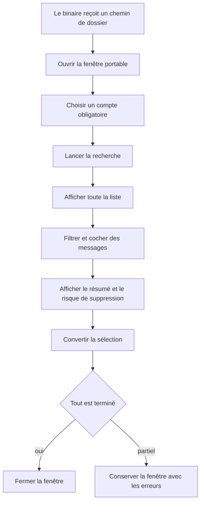
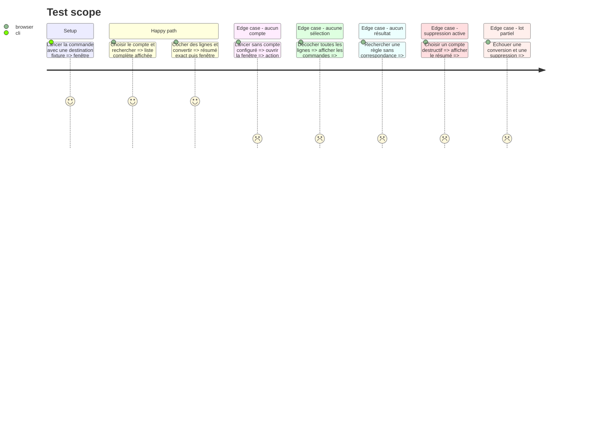

# Instruction: Fenêtre de recherche et de sélection multi-OS

## Architecture projection

> Tree of the final files. ✅ create · ✏️ modify · ❌ delete

```txt
.
├── ✅ assets/contextual_export.html
├── ✏️ src/main.rs
├── ✏️ src/tray.rs
├── ✏️ src/tray_actions.rs
├── ✏️ src/contextual_export.rs
└── ✏️ tests/rust_tests.rs
```

## User Journey



## Test Scope



## Wireframe

```txt
┌──────────────────────────────────────────────────────────────────────┐
│ (1) Répertoire cible                                                 │
│     [ chemin courant ]                                               │
├──────────────────────────────────────────────────────────────────────┤
│ (2) Boîte aux lettres [ compte ▼ ]   (3) Règles [ adresses associées ]│
│                                      [ Rechercher ]                  │
├──────────────────────────────────────────────────────────────────────┤
│ (4) [Tout sélectionner]   [filtre texte________________]             │
│ ┌───┬────────────┬────────────────┬────────────────────┬───────────┐ │
│ │ ✓ │ Date       │ Correspondant  │ Objet              │ Dossier   │ │
│ ├───┼────────────┼────────────────┼────────────────────┼───────────┤ │
│ │   │            │                │                    │           │ │
│ └───┴────────────┴────────────────┴────────────────────┴───────────┘ │
├──────────────────────────────────────────────────────────────────────┤
│ (5) Résumé de sélection et avertissement de suppression éventuel     │
│                                      [Annuler] [Convertir]           │
└──────────────────────────────────────────────────────────────────────┘
```

1. Confirme le répertoire reçu depuis le gestionnaire de fichiers.
2. Rend obligatoire le choix de la boîte aux lettres.
3. Montre les règles qui produisent la recherche.
4. Présente et filtre la liste complète des résultats sélectionnables.
5. Résume l’action finale et rend visible le risque de suppression serveur.

## Tasks to do

### `1)` Ajouter un point d’entrée portable

> Ouvrir le flux contextuel avec un chemin sur chaque OS supporté.

1. Ajouter une sous-commande recevant un unique dossier local.
2. Charger la configuration et valider la destination avant toute connexion.
3. Compiler le point d’entrée sous Windows, macOS et Linux avec la feature GUI.

### `2)` Construire la fenêtre et son état

> Piloter choix du compte, recherche, sélection et conversion dans une seule WebView.

1. Ajouter un état de fenêtre et des commandes dédiées dans la boucle `tao`.
2. Injecter chemin, comptes et règles avec l’échappement JSON existant.
3. Exécuter IMAP hors du thread UI et transmettre les résultats par événements.
4. Empêcher les doubles recherches et conversions concurrentes.

### `3)` Présenter et sélectionner les résultats

> Rendre la liste complète exploitable sans reproduire toute l’interface de Thunderbird.

1. Afficher sélection, date, correspondant, sujet et dossier IMAP.
2. Ajouter filtre local et sélection globale.
3. Laisser toutes les lignes décochées après chaque recherche; « Tout sélectionner » ne coche que le filtre visible et « Tout effacer » retire toute sélection.
4. Marquer les candidats déjà présents et les laisser décochés par défaut.
5. Permettre de sélectionner un candidat prouvé comme déjà converti pour une action « suppression seulement », sans réécriture.
6. Afficher un état vide normal lorsque la recherche ne trouve rien et désactiver la conversion lorsque la sélection est vide.
7. Paginer ou virtualiser l’affichage par blocs de 200 lignes pour ne pas injecter toute la liste dans le DOM.
8. Rendre compte, sélecteur, filtre, cases et actions utilisables au clavier, correctement libellés et avec focus visible.
9. Valider avec une fixture de 10000 candidats: saisie toujours réactive et filtre appliqué en moins de 500 ms sur la machine de référence documentée.

### `4)` Terminer le flux sans masquer les erreurs

> Fermer automatiquement uniquement lorsque l’opération demandée est terminée.

1. Montrer le nombre de conversions et l’avertissement du compte.
2. Afficher avant sélection si la suppression ciblée est supportée; bloquer l’action lorsque la configuration exige une suppression que le serveur ne peut garantir.
3. Demander une confirmation finale indiquant le nombre exact de messages sélectionnés et, si applicable, supprimés du serveur.
4. Fermer après réussite complète.
5. En cas de résultat partiel, conserver la fenêtre, figer les réussites et afficher séparément conversion à réessayer et suppression à réessayer.
6. Rafraîchir entièrement la recherche si la session ou UIDVALIDITY a invalidé les candidats.
7. Permettre l’annulation avant la conversion sans effet local ou serveur.
8. Afficher une action de configuration lorsque le mot de passe manque et un diagnostic réessayable pour les erreurs réseau.

## Test acceptance criteria

| Task | Acceptance criteria |
| ---- | ------------------- |
| 1 | La même commande accepte un chemin natif Windows, macOS ou Linux et refuse les cibles non configurées. |
| 2 | La fenêtre reste réactive pendant la recherche et la conversion, sans double opération. |
| 3 | La liste commence décochée, les sélections globales respectent le filtre, toutes les commandes sont accessibles au clavier, les preuves locales proposent la suppression seule et 10000 candidats restent manipulables selon le seuil documenté. |
| 4 | La fenêtre se ferme sur réussite complète; un lot partiel distingue clairement reprise de conversion, reprise de suppression et recherche devenue périmée. |
