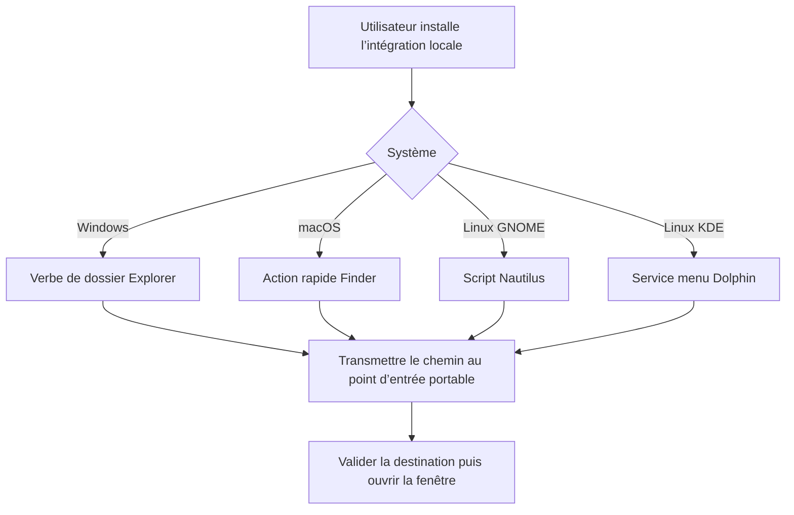
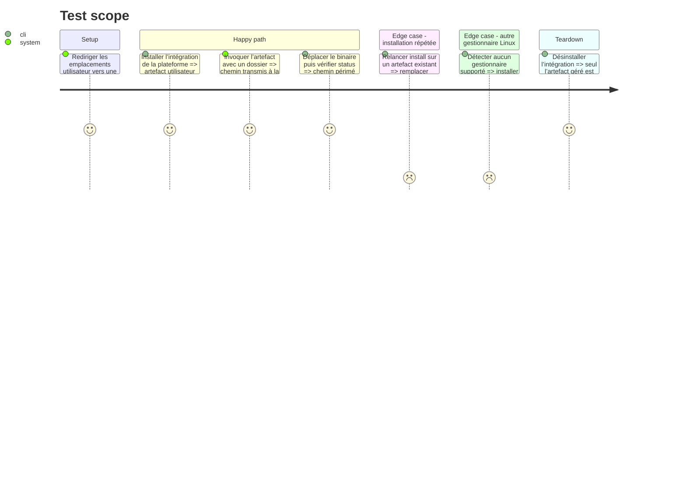

# Instruction: Déclencheurs des gestionnaires de fichiers

## Architecture projection

> Tree of the final files. ✅ create · ✏️ modify · ❌ delete

```txt
.
├── ✅ src/shell_integration/mod.rs
├── ✅ src/shell_integration/windows.rs
├── ✅ src/shell_integration/macos.rs
├── ✅ src/shell_integration/linux.rs
├── ✅ packaging/macos/Email to Markdown.workflow/Contents/document.wflow
├── ✅ packaging/linux/email-to-markdown-nautilus
├── ✅ packaging/linux/email-to-markdown-dolphin.desktop
├── ✅ .github/workflows/ci.yml
├── ✅ docs/manual-qa-contextual-export.md
├── ✏️ src/lib.rs
├── ✏️ src/main.rs
├── ✏️ Cargo.toml
├── ✏️ README.md
└── ✏️ aidd_docs/memory/deployment.md
```

## User Journey



## Test Scope



## Tasks to do

### `1)` Définir l’interface d’intégration

> Installer, inspecter et retirer un déclencheur utilisateur sans privilèges administrateur.

1. Ajouter les opérations install, status et uninstall.
2. Résoudre le chemin absolu du binaire et le citer correctement.
3. Rendre les opérations idempotentes et limiter les suppressions aux artefacts nommés par l’application.
4. Garder tout le code spécifique derrière `cfg(target_os)`.
5. Faire comparer `status` au chemin courant; `install` répare un ancien chemin et l’auto-updater réinstalle l’intégration après remplacement réussi.
6. Refuser l’installation depuis un binaire sans feature GUI et fournir la commande de reconstruction attendue.

### `2)` Intégrer Windows Explorer

> Ajouter un verbe de dossier par utilisateur.

1. Enregistrer la commande sous HKCU avec le chemin du binaire et le paramètre dossier.
2. Enregistrer l’action pour l’élément dossier et pour l’arrière-plan du dossier courant.
3. Gérer les chemins contenant espaces et caractères non ASCII.
4. Vérifier et retirer uniquement les clés appartenant à l’application.

### `3)` Intégrer macOS Finder

> Installer une action rapide Finder appelant le même point d’entrée.

1. Fournir un workflow Automator recevant des dossiers.
2. Installer sa copie utilisateur dans `Library/Services` avec le chemin du binaire résolu.
3. Documenter l’activation éventuelle dans les réglages Extensions.
4. Définir le dossier sélectionné comme interaction portable de référence.

### `4)` Intégrer les gestionnaires Linux pris en charge

> Couvrir GNOME/Nautilus et KDE/Dolphin sans prétendre couvrir tous les gestionnaires.

1. Installer le script Nautilus dans le répertoire utilisateur attendu.
2. Installer le service menu Dolphin pour `inode/directory` et le rendre exécutable.
3. Détecter les environnements disponibles et rapporter clairement ceux qui ne sont pas pris en charge.
4. Accepter le dossier sélectionné partout et le dossier courant lorsque le gestionnaire fournit explicitement son URI local.
5. Décoder les URI `file://` avec une bibliothèque d’URL, refuser les autres schémas et ne jamais transmettre une URI distante comme chemin local.

### `5)` Valider la portabilité et documenter

> Empêcher toute régression de compilation ou de distribution sur un autre OS.

1. Tester les rendus d’artefacts avec des répertoires temporaires.
2. Ajouter une matrice GitHub Actions `windows-latest`, `macos-latest` et `ubuntu-24.04` pour check, clippy, tests et build GUI avec dépendances WebView explicites.
3. Ajouter sur Ubuntu un job Dovecot jetable qui exécute les tests IMAP ignorés explicitement sélectionnés; garder le test Gmail destructif manuel et protégé par secret.
4. Exécuter la recette manuelle sur Windows 11 Explorer, la version macOS courante Finder, Ubuntu 24.04 Nautilus et KDE Neon stable Dolphin; joindre version, capture et résultat à la release.
5. Documenter WebView2 sous Windows, WebKit sous macOS, WebKitGTK sous Linux, ainsi que les paquets requis et la nécessité de distribuer un binaire construit avec la feature GUI.
6. Documenter installation, emplacement dans chaque menu, désinstallation et commande portable de secours.
7. Noter que l’entrée peut apparaître sur des dossiers non configurés, mais que l’application les refuse avant toute connexion IMAP.

## Test acceptance criteria

| Task | Acceptance criteria |
| ---- | ------------------- |
| 1 | Install, status et uninstall sont idempotents, sans privilèges administrateur, détectent un chemin de binaire périmé et ne touchent pas aux artefacts tiers. |
| 2 | Explorer transmet exactement le dossier sélectionné ou courant, y compris avec espaces et Unicode. |
| 3 | Finder propose l’action rapide sur un dossier et transmet son chemin au binaire. |
| 4 | Nautilus et Dolphin transmettent un chemin local décodé; les URI distantes et gestionnaires non pris en charge reçoivent un diagnostic et la commande de secours. |
| 5 | La matrice CI compile le cœur et la GUI sur les trois OS, et la recette manuelle passe sur les quatre couples OS/gestionnaire nommés. |
