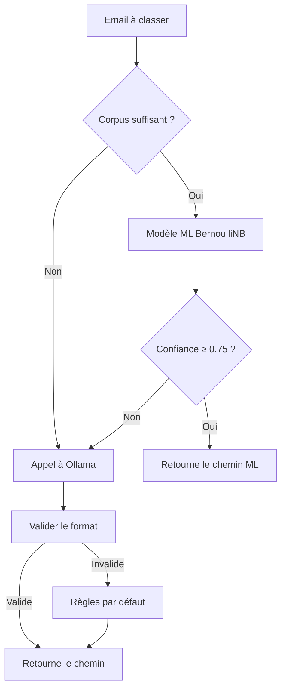

# email-to-python-tools

Outils Python CLI pour traiter les emails exportés en Markdown par [email-to-markdown](../email-to-markdown).

## Scripts

### `scripts/summarize.py` — Résumer les emails

Pipeline complet : parse → déduplique → catégorise → groupe → résume via LLM → classe interactivement.

```bash
python scripts/summarize.py [--config config/config.yaml] [--input DIR] [--output DIR] [--delete] [--no-classify]
```

| Option | Description |
|---|---|
| `--config` | Fichier de configuration (défaut: `config/config.yaml`) |
| `--input` | Dossier d'entrée (remplace `paths.input_dir`) |
| `--output` | Dossier de sortie des résumés (remplace `paths.notes_dir`) |
| `--delete` | Supprime les sources au lieu de les archiver |
| `--no-classify` | Désactive le classement interactif après résumé |

### `scripts/classify.py` — Classer les emails

Classement interactif des emails bruts dans une arborescence 3 niveaux définie par l'utilisateur. Utilise Ollama (gratuit, local) au démarrage, puis un modèle BernoulliNB entraîné progressivement.

```bash
python scripts/classify.py [--config config/config.yaml] [--account NOM]
```

| Option | Description |
|---|---|
| `--config` | Fichier de configuration (défaut: `config/config.yaml`) |
| `--account` | Filtrer les comptes IMAP par nom (substring) |

**Commandes interactives :** `[Entrée]` accepter · `s` ignorer · `q` quitter · saisir un chemin alternatif

#### Workflow de classement avec fallback vers Ollama



**Détails :**
- **Cold start** : Si le corpus contient moins de 20 exemples, Ollama est utilisé.
- **Fallback dynamique** : Si la confiance du modèle ML est < 0.75, bascule vers Ollama.
- **Validation stricte** : Le chemin retourné par Ollama doit respecter le format `Niveau1/Niveau2/Niveau3` (ex: `Travail/Projets/ClientX`).
- **Caractères interdits** : `?`, `*`, `"`, `<`, `>`, `|`.
- **Longueur maximale** : 50 caractères par niveau.

**Exemple de configuration :**
```yaml
classify:
  cold_start_model: "qwen3:8b"  # Modèle Ollama utilisé pour le fallback
  confidence_threshold: 0.75     # Seuil de confiance pour le modèle ML
  min_samples_before_ml: 20       # Nombre minimal d'exemples avant d'utiliser le ML
```

### `scripts/reorganize.py` — Réorganiser l'arborescence

Restructure interactivement l'arborescence de destination (renommer, fusionner, déplacer des branches). Met à jour automatiquement le corpus d'apprentissage.

```bash
python scripts/reorganize.py [--config config/config.yaml]
```

### `scripts/validate_format.py` — Valider le format

Vérifie que les fichiers .md d'entrée respectent le format attendu.

```bash
python scripts/validate_format.py /chemin/vers/dossier/
```

## Installation

```bash
pip install -r requirements.txt
```

> **PowerShell (Windows)** — ne pas utiliser `.venv\Scripts\python.exe` directement : PowerShell interprète le point initial comme un nom de module. Utiliser `&` ou `.\` :
> ```powershell
> & .venv\Scripts\python.exe scripts/classify.py
> # ou
> .\.venv\Scripts\python.exe scripts/classify.py
> ```

**Prérequis pour le classement :** [Ollama](https://ollama.com) installé et le modèle téléchargé :
```bash
ollama pull qwen3:8b
```

**Vérification de la configuration :**
- Assurez-vous que `config/config.yaml` contient bien la clé `cold_start_model` :
  ```yaml
  classify:
    cold_start_model: "qwen3:8b"  # Modèle utilisé pour le fallback
  ```

## Configuration

Copier et adapter `config/config.yaml` :

```yaml
llm:
  api_key: "sk-..."          # Clé Anthropic (pour summarize.py)
  model: "claude-sonnet-4-6"

paths:
  input_dir: "/chemin/vers/emails/to-summarize"
  processed_dir: "/chemin/vers/emails/processed"
  notes_dir: "/chemin/vers/notes"

classify:
  input_dirs:
    - "/chemin/vers/emails/compte@gmail.com"
    - "/chemin/vers/emails/compte@domaine.fr"
  exclude_dirs: ["trash", "attachments", "sent", "[Gmail]"]
  output_dir: "/chemin/vers/emails/classified"
  confidence_threshold: 0.75
  min_samples_before_ml: 20
  data_dir: "data"
  cold_start_model: "qwen3:8b"
```

## Apprentissage incrémental

Le classifieur apprend de chaque validation utilisateur :

1. **Cold start** (< 20 exemples) : Ollama/Qwen3 propose un chemin
2. **Apprentissage** (≥ 20 exemples) : BernoulliNB prend le relais
3. **Fallback** : si confiance < 0.75, retour à Ollama

Les données d'apprentissage sont stockées dans `data/` (gitignored). Pour reconstruire le modèle depuis le corpus : `rebuild_model_from_corpus()` dans `src/folder_classifier.py`.

## Format des emails

Les fichiers `.md` produits par `email-to-markdown` ont le format :

```yaml
---
from: Expéditeur <email@domaine.com>
to: destinataire@domaine.com
date: 2026-04-17T10:00:00+00:00
subject: Sujet de l'email
tags: [INBOX]
attachments: []
---

Corps de l'email...
```